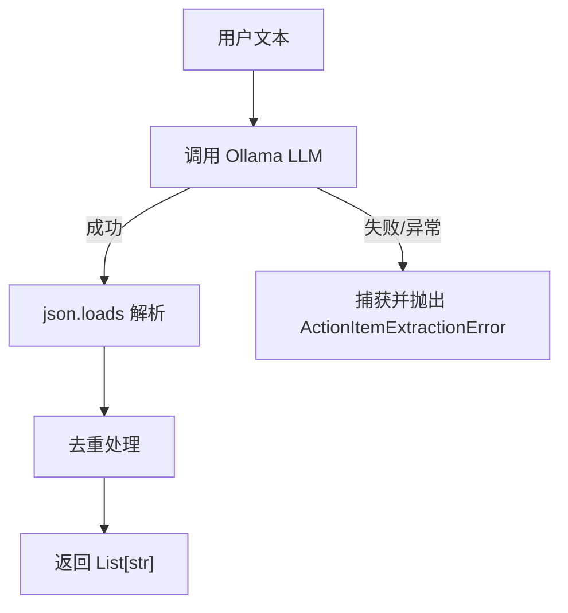

# 使用 LLM 提取待办事项

## 修改范围

仅修改 [`week2/app/services/extract.py`](week2/app/services/extract.py) 文件，路由层无需改动。

## 实现方案



### 1. 新增自定义异常类

```python
class ActionItemExtractionError(Exception):
    """待办事项提取失败"""
    pass
```

### 2. 使用 Ollama 的 JSON 模式

Ollama 支持 `format="json"` 参数，强制 LLM 输出有效的 JSON 格式：

```python
response = chat(
    model="llama3.1:8b",
    messages=[{"role": "user", "content": prompt}],
    options={"temperature": 0},
    format="json",  # 强制 JSON 输出
)
items = json.loads(response.message.content)
```

### 3. 新增 LLM 提取函数（带异常处理）

```python
def _extract_with_llm(text: str) -> List[str]:
    prompt = f"""从以下文本中提取所有待办事项/行动项。
返回 JSON 对象，格式为: {{"items": ["待办事项1", "待办事项2"]}}
如果没有待办事项，返回: {{"items": []}}

文本：
{text}
"""
    try:
        response = chat(
            model="llama3.1:8b",
            messages=[{"role": "user", "content": prompt}],
            options={"temperature": 0},
            format="json",
        )
        result = json.loads(response.message.content)
        return result.get("items", [])
    except Exception as e:
        raise ActionItemExtractionError(f"LLM 提取失败: {e}") from e
```

### 4. 重写主函数

```python
def extract_action_items_llm(text: str) -> List[str]:
    items = _extract_with_llm(text)
    return _deduplicate(items)
```

### 5. 抽取去重函数

```python
def _deduplicate(items: List[str]) -> List[str]:
    seen: set[str] = set()
    unique: List[str] = []
    for item in items:
        lowered = item.lower()
        if lowered not in seen:
            seen.add(lowered)
            unique.append(item)
    return unique
```

### 6. 删除旧的正则提取代码

删除以下不再需要的代码：
- `BULLET_PREFIX_PATTERN` 常量
- `KEYWORD_PREFIXES` 常量
- `_is_action_line()` 函数
- `_looks_imperative()` 函数
- `_extract_with_regex()` 函数

## 最终文件结构

```python
from __future__ import annotations
import json
from typing import List
from ollama import chat

class ActionItemExtractionError(Exception):
    """待办事项提取失败"""
    pass

def _extract_with_llm(text: str) -> List[str]: ...
def _deduplicate(items: List[str]) -> List[str]: ...
def extract_action_items_llm(text: str) -> List[str]: ...
```
