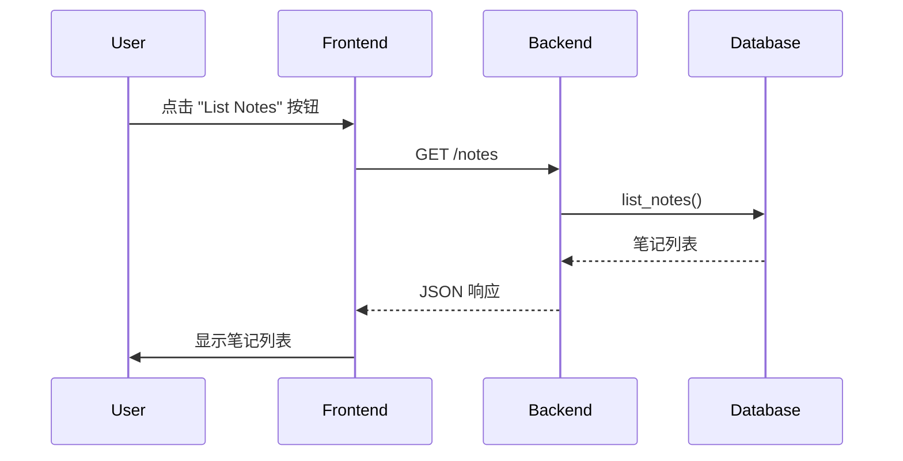

# 添加 "List Notes" 按钮功能

## 现状分析

- 后端：`db.py` 中已有 `list_notes()` 函数，但 `notes.py` router 中**没有**对应的 GET `/notes` 端点
- 前端：`index.html` 目前只有 Extract 按钮，没有显示笔记列表的功能

## 实现步骤

### 1. 后端：添加获取笔记列表的 API 端点

在 [`week2/app/routers/notes.py`](week2/app/routers/notes.py) 中添加：

```python
@router.get("", response_model=list[NoteResponse])
def list_all_notes() -> list[NoteResponse]:
    notes = db.list_notes()
    return [
        NoteResponse(id=n.id, content=n.content, created_at=n.created_at)
        for n in notes
    ]
```

### 2. 前端：添加 UI 和交互逻辑

在 [`week2/frontend/index.html`](week2/frontend/index.html) 中：

- 在按钮区域添加 "List Notes" 按钮
- 添加一个用于显示笔记列表的容器 `<div id="notes">`
- 添加 JavaScript 逻辑：点击按钮时调用 `GET /notes`，将结果渲染到页面

## 数据流


